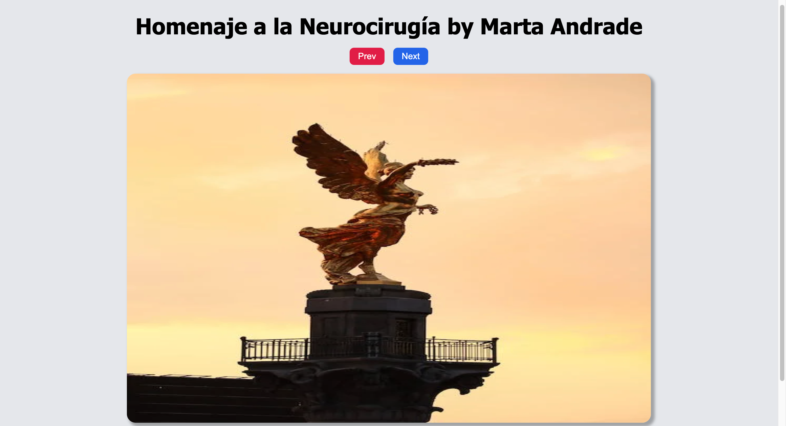
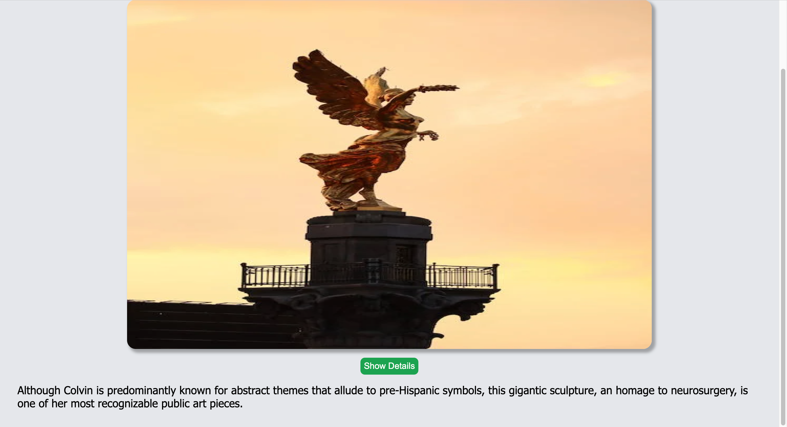

# First React App

This is an application that the first time I use React.js

## Table of contents

- [Overview](#overview)
  - [Screenshot](#screenshot)
  - [Links](#links)
- [My process](#my-process)
  - [Built with](#built-with)
  - [What I learned](#what-i-learned)
  - [Continued development](#continued-development)
- [Author](#author)

## Overview

### Screenshot




### Links

- Live Site URL: [Add live site URL here](https://morcicek-first-react-app.netlify.app)

## My process

### Built with

- CSS custom properties
- Flexbox
- Sass-CSS preprocessor
- Responsive Design
- React.js Basics

### What I learned

I learned essential parts of responsive design at this challenge.Also I reinrorced some konowledge I have about CSS.

To see how you can add code snippets, see below:

```html
<div class="main-right">
  <h2 class="main-right_title">New</h2>
  <div class="main-right_subtitle">
    <a href="#">Hydrogen VS Electric Cars</a>
    <p>Will hydrogen-fueled cars ever catch up to EVs?</p>
  </div>
</div>
```

```css
.main-right {
  width: 60rem;
  padding: 2rem;
  background-color: hsl(240, 100%, 5%);
  color: hsl(36, 100%, 99%);
}
```

### Continued development

- Responsive Design
- Sass

### Useful resources

## Author

- Github - [morcicek](https://github.com/morcicek)
- Frontend Mentor - [@morcicek](https://www.frontendmentor.io/profile/morcicek)
- Twitter - [@morcicek_m](https://twitter.com/morcicek_m)
